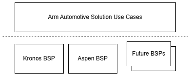
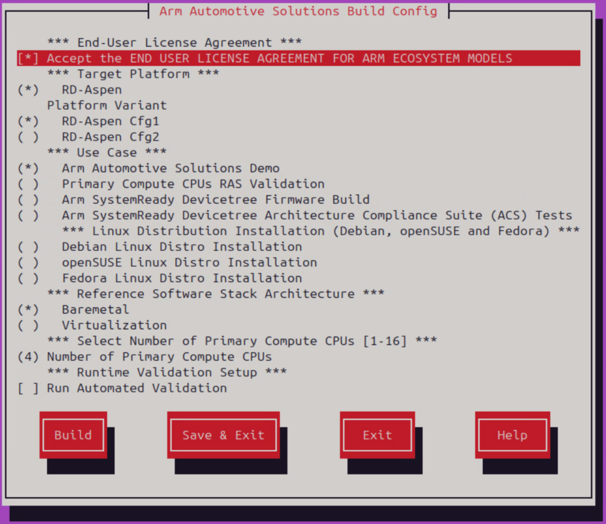
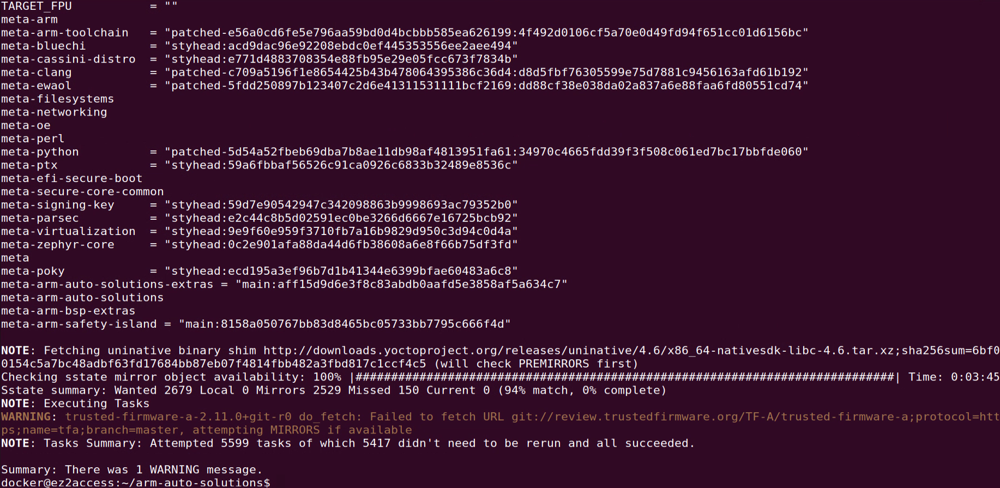
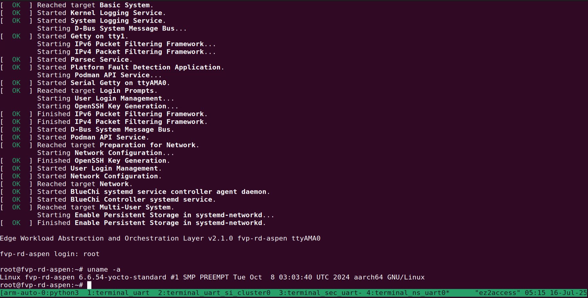
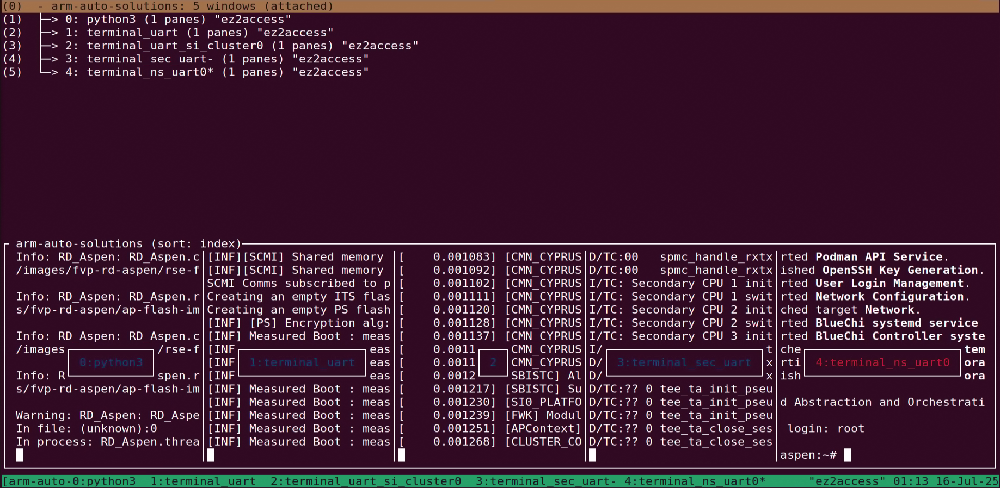

<div align="center"><p><a href="./README.md"></a>  <a href="./README_ja.md"></a> </p></div>

# Arm Reference Software Stack for Zena CSS

## 🔒 Preface

This guide covers:
- Building a Docker image with required packages
- Building Yocto with the Zena CSS software stack
- Running the demo

---

## 🧭 Overview 

Arm Automotive Solutions is a parent project containing a collection of resources to provide a representative view of typical compute subsystems that can be designed and implemented using specific generations of Arm Reference Designs, targeting the automotive sector.



It contains BSPs (board support packages) for the following child projects:
- Kronos Reference Software Stack 
- Zena CSS Reference Software Stack

📢 Build Host Requirements
- x86_64 or aarch64 host to build and execute the FVP
- At least 300GiB of free disk for the download and builds
- At least 32GiB of RAM memory
- At least 8GiB of swap memory

---

## 0. 🔶Enable Unprivileged User Namespaces on the Host

You need root privileges on the host machine to run the following commands, which enable unprivileged user namespaces before launching this reference software stack.

※ These settings will reset after the host is rebooted.
```bash
sudo sysctl -w kernel.apparmor_restrict_unprivileged_userns=0
sudo sysctl -w kernel.unprivileged_userns_clone=1
```

## 1. 🐳 Build the Docker Image

If Docker is not yet installed on your build host, please follow the [installation instructions](https://docs.docker.com/engine/install/) to set up the `Docker Engine`.

Use [`docker_build.sh`](./docker_build.sh) to build a Docker image based on the provided [`Dockerfile`](./Dockerfile).  
This image is based on **Ubuntu 22.04** and includes required packages for ARM automotive software stack v2.1 development.

```bash
./docker_build.sh
```

---

## 2. 🚀 Run the Docker Container

Use [`docker_run.sh`](./docker_run.sh) to start a Docker container using the built image.

Use the `-s` flag to share your host's home directory with the container (`/home/docker/share`):

- Default Login: **docker**
- Password: **docker**

```bash
./docker_run.sh -s share_folder
```

---

## 3. 🔧 Build the Automotive ARM Software Stack & Demo

Once inside the container, your working directory will be `/home/docker/arm-auto-solutions`, containing:

- The `sw-ref-stack` folder
- The `run_fvp.sh` script

The `sw-ref-stack` comes from [Arm Automotive Solutions Repository](https://gitlab.arm.com/automotive-and-industrial/arm-auto-solutions/sw-ref-stack) and enables quick setup using **kas** for Yocto builds.

A menu config file is located at: `/home/docker/arm-auto-solutions/sw-ref-stack/Kconfig`

To launch the build menu:

```bash
kas menu sw-ref-stack/Kconfig
```



Recommended menu options:

- **Platform**: RD-Aspen  
- **Variant**: RD-Aspen Cfg1
- **Use-Case**: Arm Automotive Solutions Demo  
- **Stack Architecture**: Baremetal  
- **Primary CPUs**: 4  

⚠️ Select **Build** to start the full software stack compilation. This process may take **several hours**.



### 📦 YAML Layer Architecture & Dependencies

The kas YAML configuration specifies dependencies on multiple Yocto layers:

```
meta-arm-auto-solutions
├── meta-arm-bsp-extras       # RD-Aspen BSP and patches
├── meta-arm                  # Core toolchain & SystemReady DT
├── meta-ewaol                # SOAFEE reference OS
├── meta-security             # Secure services (Parsec, TLS)
├── meta-virtualization       # (optional for Xen)
├── meta-zephyr               # Safety Island (R82AE) firmware
└── poky/meta                 # Yocto base system
```
Each layer is pinned to a specific Git URL, branch, and revision for reproducibility.

### 🧱 Software Architecture (RD-Aspen)

RD-Aspen features a tripartite system consisting of:

#### ✅ RSE (Runtime Security Engine)
- Cortex-M55 core
- Runs TF-M (BL1_1 → BL1_2 → BL2 → Runtime)
- Services: Secure boot, PSA Crypto, Secure Storage, UEFI Variable Storage
- Entry point of the secure boot chain and attestation

#### ✅ Safety Island
- Cortex-R82AE core
- Runs SCP-firmware
- Responsible for power control, system boot sequencing
- Hosts Safety Status Unit (SSU) and Fault Management Unit (FMU)

#### ✅ Primary Compute
- Cortex-A720AE cores (up to 16)
- Boot flow:
  - TF-A BL2 → BL31
  - OP-TEE BL32
  - U-Boot BL33 → Linux (systemd-boot)
- Supports:
  - Arm SystemReady Devicetree (UEFI+DT)
  - UEFI Secure Boot (via RSE-backed PK, KEK, db, dbx)
  - Capsule-based Secure Firmware Update
  - PFDI (fault detection & CLI)
  - PSA APIs (Crypto, Storage, Attestation)
  - CAM (Critical App Monitoring)
  - Linux Distro Validation: Debian / openSUSE / Fedora

---

## 4. ▶️ Run the Software Stack on Zena CSS FVP

The demo uses **`tmux`** to manage terminal sessions.

Run the following to boot the software stack (may take several minutes):

```bash
tmux new-session -s arm-auto-solutions
./run_fvp.sh
```

- Default user: `root`
- Password: *(none)*



There are four terminal consoles on this tmux session.
`ctrl + b` + `w` to switch terminal.



### Terminal Console Mapping in FVP

The following table explains the purpose of each tmux terminal window used in the Arm Automotive Solutions FVP environment:

| **tmux Pane Name**             | **Function**                                                                 |
|-------------------------------|------------------------------------------------------------------------------|
| `terminal_uart`               | Console for the **RSE (Runtime Security Engine)**. It displays logs related to secure boot, image authentication, and secure service initialization. |
| `terminal_uart_si_cluster0`   | Console for **Safety Island Cluster 0**, typically used for diagnostics and running integration tests (e.g., FMU/SSU). |
| `terminal_sec_uart`           | Console for the **Application Processor (AP) Secure World**, such as Trusted Firmware-A (TF-A) and OP-TEE. (EL3/EL1S）|
| `terminal_ns_uart0`           | Console for the **Application Processor (AP) Non-Secure World**, which runs Linux. This is the main interface where users interact with the system. (EL2/EL1N，OS) |

Each terminal maps to a different processing element in the Fixed Virtual Platform (FVP):

- `terminal_uart` → RSE (e.g., TF-M, secure boot root)
- `terminal_uart_si_cluster0` → Safety Island (e.g., FMU, SSU)
- `terminal_sec_uart` → Secure firmware (e.g., TF-A, secure partitions)
- `terminal_ns_uart0` → Linux user space (non-secure execution environment)

These are essential for debugging different system domains and privilege levels.

---

## 🧪 Run Tests

### ✅ Safety Status Unit (SSU)

*Under Construction*

### ✅ Fault Management Unit (FMU)

*Under Construction*

---

## 📚 References

- [Arm Automotive Solutions Documentation](https://arm-auto-solutions.docs.arm.com/en/v2.1/index.html)
- [Arm Automotive Solutions Repository](https://gitlab.arm.com/automotive-and-industrial/arm-auto-solutions/sw-ref-stack)
- [Arm Zena Compute Subsystem (CSS) FVP](https://developer.arm.com/Tools%20and%20Software/Fixed%20Virtual%20Platforms/Automotive%20FVPs)